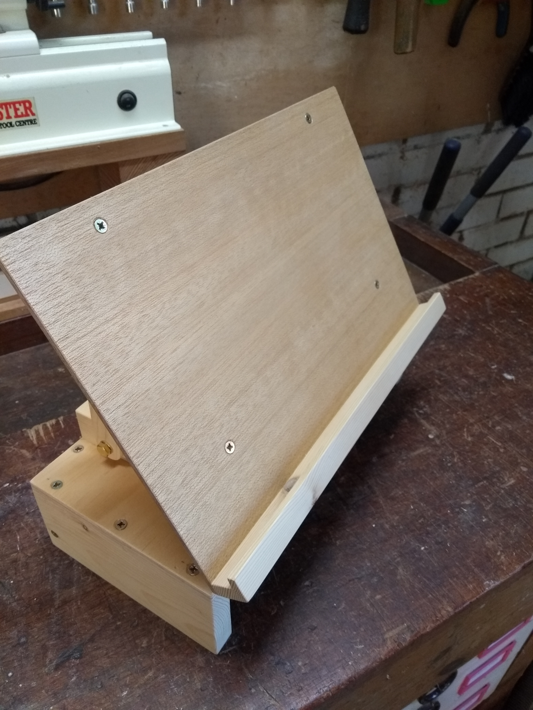
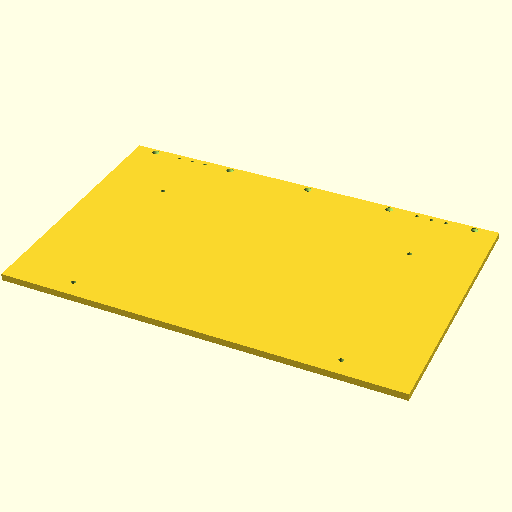
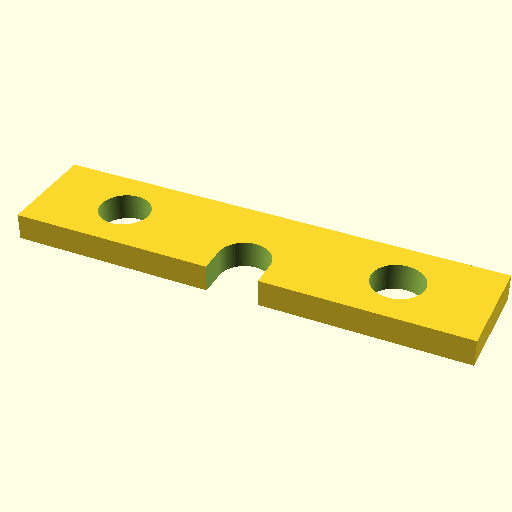
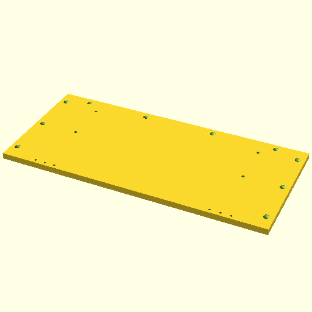
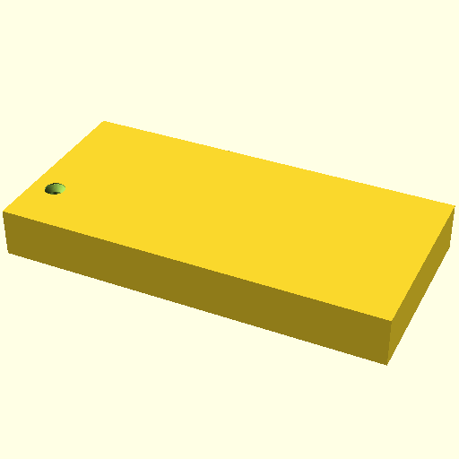
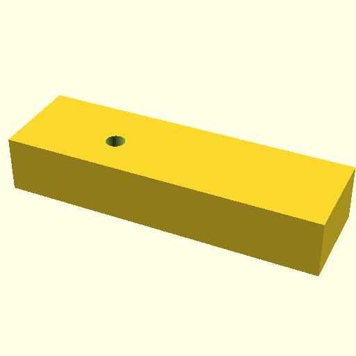
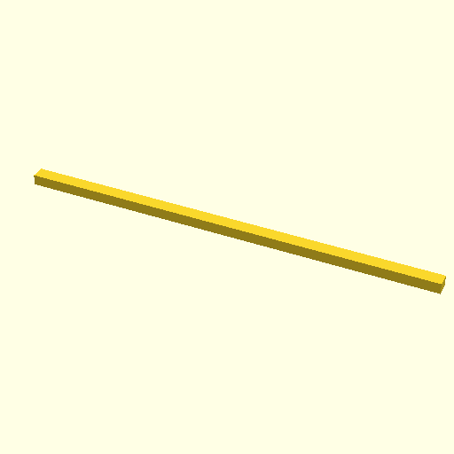
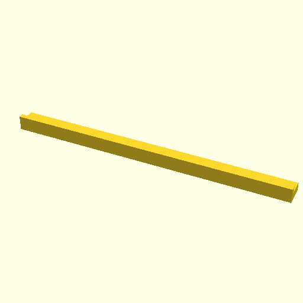
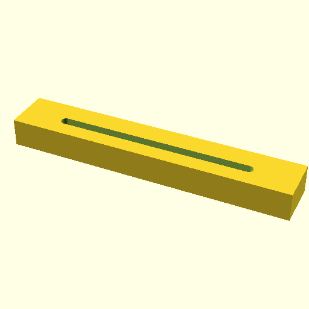
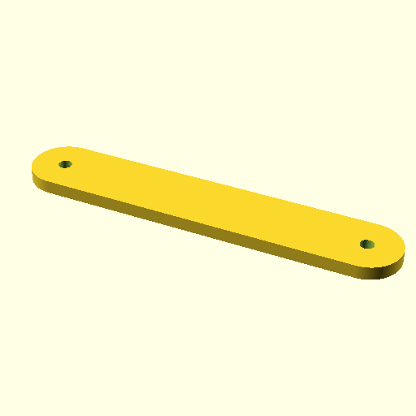

# Wooden laptop stand

A stand to hold a laptop open to nearly 180 degrees and elevated, so it can be
used as a second screen alongside a main screen.

## Parts

All parts are provided as OpenSCAD 3D models, with dimensions in
millimetres.  This is a generic design, so adjust dimensions according to the
materials available, the laptop to be supported and the height required.

### Non-wood parts

**Hinges**

These don't have to be brass, but avoid plain steel, because it will
tarnish. Bright Zinc Plated (BZP) is a cheaper alternative, or you could use
stainless steel (expensive).

* Brass hinges 1.5" x 7/8" (38mm x 22mm) (2 off)

**Screws**

- 3 x 16mm (12 off) - to fix hinges
- 3.5 x 20mm (5 off) - to fix laptop ledge to back board
- 4 x 20mm (4 off) - to fix back board to slotted support
- 4 x 25mm (4 off) - to fix base board to base support
- 4 x 30mm (10 off) - to fix base board to side and back
- 4 x 40mm (2 off) - to fix sides to back

**Nuts, bolts and washers**

These also don't have to be brass, but avoid plain steel, because it will
tarnish. Bright Zinc Plated (BZP) is a cheaper alternative, or you could use
stainless steel (expensive).

You don't need to have wing nuts, but it avoids needing a spanner to adjust
the angle. I wasn't able to source the larger form C brass washers, but they
would be better if you can get them.

- M6 x 40mm hex head brass machine screws (4 off)
- M6 brass washers (8 off) - form C if available, but form A is OK
- M6 brass hex nuts (2 off)
- M6 brass wing nuts (2 off)

### Wood parts

**Back board**

([STL](./drawings/back-board.stl), [OpenSCAD](./drawings/back-board.scad))

The board on which the laptop rests

**Base back**

([STL](./drawings/base-back.stl), [OpenSCAD](./drawings/base-back.scad))

The support for the back edge of the base board.

**Base board**

([STL](./drawings/base-board.stl), [OpenSCAD](./drawings/base-board.scad))

The board forming the top of the base.

**Base side (2 off)**

([STL](./drawings/base-side.stl), [OpenSCAD](./drawings/base-side.scad))

The support for the side edges of the base board.

**Base support (2 off)**

([STL](./drawings/base-support.stl), [OpenSCAD](./drawings/base-support.scad))

Strut support which sits on the base board.

**Hinge backstop**

([STL](./drawings/hinge-backstop.stl),
[OpenSCAD](./drawings/hinge-backstop.scad))

A strip providing backing for the hinge screws into the base.

**Ledge**

([STL](./drawings/ledge.stl), [OpenSCAD](./drawings/ledge.scad))

The ledge fixed at the bottom of the back board on which the edge of the
laptop rests.

**Slot support (2 off)**

([STL](./drawings/slot-support.stl), [OpenSCAD](./drawings/slot-support.scad))

Slotted support underneath the back board which connnects to the strut.

**Strut (2 off)**

([STL](./drawings/strut.stl), [OpenSCAD](./drawings/strut.scad))

The adjustable struts connecting the base to the back board.

## Construction
