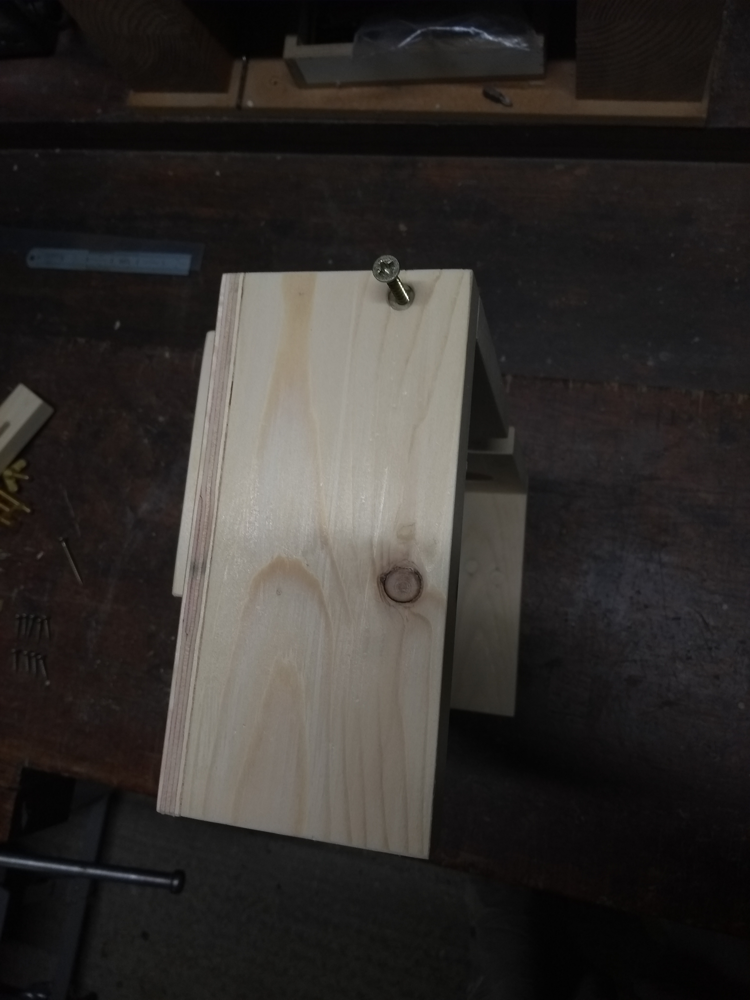

# Wooden laptop stand

A stand to hold a laptop open to nearly 180 degrees and elevated, so it can be
used as a second screen alongside a main screen.  The wood used in the stand
illustrated here was almost all reclaimed from an old pallet and an old
packing case.

## Parts

All parts are provided as OpenSCAD 3D models, with dimensions in
millimetres.  This is a generic design, so adjust dimensions according to the
materials available, the laptop to be supported and the height required.

### Non-wood parts

**Hinges**

These don't have to be brass, but avoid plain steel, because it will
tarnish. Bright Zinc Plated (BZP) is a cheaper alternative, or you could use
stainless steel (expensive).

* Brass hinges 1.5" x 7/8" (38mm x 22mm) (2 off)

**Screws**

- 3 x 16mm (12 off) - to fix hinges
- 3.5 x 20mm (5 off) - to fix laptop ledge to back board
- 4 x 20mm (4 off) - to fix back board to slotted support
- 4 x 25mm (4 off) - to fix base board to base support
- 4 x 30mm (10 off) - to fix base board to side and back
- 4 x 40mm (2 off) - to fix sides to back

**Nuts, bolts and washers**

These also don't have to be brass, but avoid plain steel, because it will
tarnish. Bright Zinc Plated (BZP) is a cheaper alternative, or you could use
stainless steel (expensive).

You don't need to have wing nuts, but it avoids needing a spanner to adjust
the angle. I wasn't able to source the larger form C brass washers, but they
would be better if you can get them.

- M6 x 40mm hex head brass machine screws (4 off)
- M6 brass washers (8 off) - form C if available, but form A is OK
- M6 brass hex nuts (2 off)
- M6 brass wing nuts (2 off)

### Wood parts

**Back board**

([STL](./drawings/back-board.stl), [OpenSCAD](./drawings/back-board.scad))

The board on which the laptop rests

**Base back**

([STL](./drawings/base-back.stl), [OpenSCAD](./drawings/base-back.scad))

The support for the back edge of the base board.

**Base board**

([STL](./drawings/base-board.stl), [OpenSCAD](./drawings/base-board.scad))

The board forming the top of the base.

**Base side (2 off)**

([STL](./drawings/base-side.stl), [OpenSCAD](./drawings/base-side.scad))

The support for the side edges of the base board.

**Base support (2 off)**

([STL](./drawings/base-support.stl), [OpenSCAD](./drawings/base-support.scad))

Strut support which sits on the base board.

**Hinge backstop**

([STL](./drawings/hinge-backstop.stl),
[OpenSCAD](./drawings/hinge-backstop.scad))

A strip providing backing for the hinge screws into the base.

**Ledge**

([STL](./drawings/ledge.stl), [OpenSCAD](./drawings/ledge.scad))

The ledge fixed at the bottom of the back board on which the edge of the
laptop rests.

**Slot support (2 off)**

([STL](./drawings/slot-support.stl), [OpenSCAD](./drawings/slot-support.scad))

Slotted support underneath the back board which connnects to the strut.

**Strut (2 off)**

([STL](./drawings/strut.stl), [OpenSCAD](./drawings/strut.scad))

The adjustable struts connecting the base to the back board.

## Construction

### The base

1. Position the base supports on the base board.

2. Fix the base supports to the base board using the four 4 x 25mm screws

3. Position the sides and back of the base:

4. Note that the side holes should be aligned with the back and at the bottom:

5. Place the base board on top, with the base supports uppermost and fix to
   the back and sides using the ten 4 x 30mm screws.

6. Note that two of the screws into the back are quite close to the base
   supports, so a long screwdriver will be needed

7. Turn the base on its end and fix each side to the back using the two 4 x
   40mm screws.

8. Clamp the hinge backstop in place underneath the front of the base board,
   ready to take the end of the screws from the hinges.

9. Screw the hinges to the baseboard using six of the 3 x 16mm screws.  The
   base is now complete.

### The laptop support

1. Align the slotted support at the back of the back board. **Note** that the
   slots are not central in the support, and should be positioned, so the
   thicker side is towards the base board

2. Fix the back board to the slotted supports using the four 4 x 20mm screws.
   **Note** that these are shorter than the screws used to fix the base
   support, because the back board is thinner, and to avoid running through
   into the slot.

3. Position the ledge on the front of the back board.

4. Screw the ledge to the back board using the five 3.5 x 20mm
   screws. **Note** that the far side of the back board will need propping to
   keep it level. The laptop support is now complete.

### Putting it all together

1. Using props align the hinges on the base with the back side of the back
   board and fix the hinges with the remaining six 3 x 16mm screws. **Note**
   the ledge acts as a backstop for the screws on the back board.

2. The stand can how be set up, and will sit at an angle where the slot
   supports and the base supports touch each other.

3. Open out the stand and insert two of the M6 x 40mm hex head machine screws
   into the base support with a M6 washer under the head, with the heads on
   the inner side of each support.

4. Place one strut on each bolt, followed by a M4 washer and **two**
   nuts. Tighten the inner nut so the strut is just gently held in place, but
   moves without difficulty. Then tighten the second nut to lock the first nut
   into position.

5. Lift up the backboard, and connect the other end of the strut to the
   slotted support using the other two M6 x 40mm hex head machine screws and
   the M6 wing nuts, placing a M6 washer under the head and under the wing
   nut.

6. The laptop stand is now complete. Inevitably there will be places where
   alignment is not perfect, but these can be trimmed with a small plane and
   then be sanded to perfection.

## The stand in use

